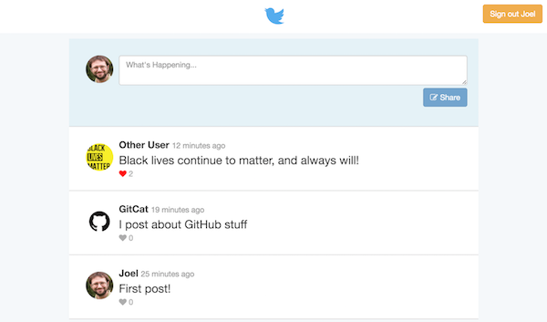

# Problems B &amp; C

In this pair of exercises, you will practice working with the [Firebase](https://firebase.google.com/) service: first for _user authentication_, then as a _realtime database_. You will be using this service to create a simple Twitter clone called "Chirper":



**Important** This problem involves creating one single application, but is broken up into two parts for clarity. Each problem has its own test suite (`.spec.js` file), but all of the instructions are included in this single README.

## Running the Program
Because this app is created with React (and scaffolded through [Create React App](https://github.com/facebook/create-react-app)), you will need to install dependencies and run a developer web server in order to transpile and view the application. You can run this server by using the command:

```bash
# from inside the `problem-bc/` folder
cd path/to/problem-bc

# install dependencies
npm install  # only once

# run the server
npm start
```

You can then view the rendered page _in a web browser_. Remember to check the Developer console for any errors!

## Problem B Instructions
Coming soon...